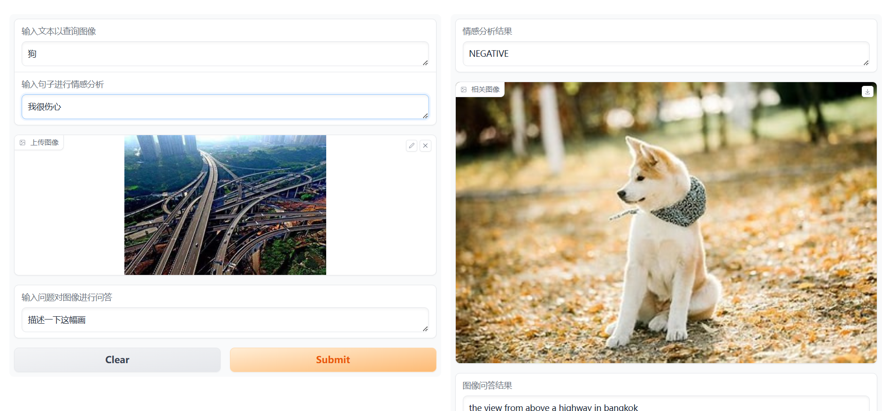

### Multimodal Assistant
#

### Project Overview
Multimodal Assistant is an intelligent assistant based on multimodal (text and image) capabilities, integrating features such as image-text retrieval, image captioning, question answering, and sentiment analysis. This project leverages state-of-the-art pre-trained models like CLIP and BLIP to facilitate efficient interaction and understanding between images and text.

### Features
- Image-Text Matching: Given a textual description, find the most relevant image (based on the CLIP model).

- Image Captioning: Generate natural language descriptions from images using the BLIP model.

- Sentiment Analysis: Perform sentiment analysis on input text (positive, negative, neutral) using the DistilBERT model.

- Image Question Answering: Given an image and a user's question, the system generates answers related to the image.

### Key Technologies
- CLIP (Contrastive Language-Image Pretraining): Used for matching similarity between images and text.
- BLIP (Bootstrapping Image-Language Pretraining): Used for generating natural language descriptions from images and answering image-related questions.
- DistilBERT: Utilized for sentiment analysis tasks to determine the sentiment of a given text.
- FAISS (Facebook AI Similarity Search): Used for efficient image vector indexing and retrieval. FAISS enables fast similarity search, allowing the project to perform image retrieval on large-scale image datasets.

### Suggestions and Issues
I hope this project is helpful to everyone，If you have any suggestions or issues, feel free to discuss them with me through the issues section. Thank you!